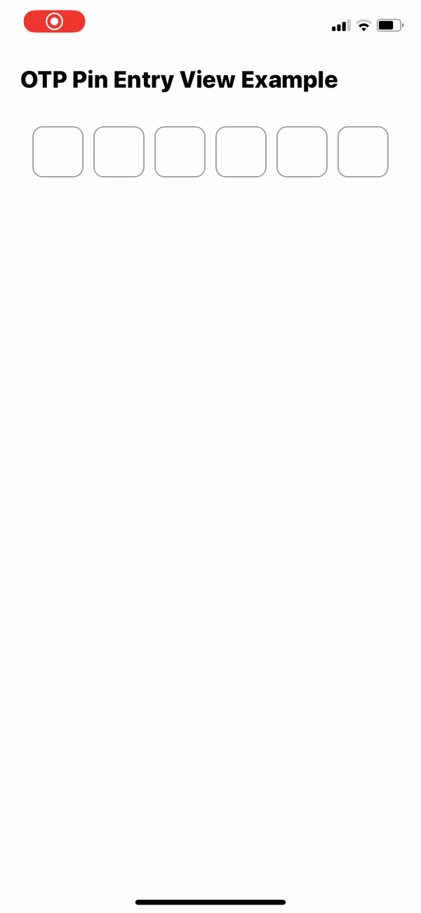

# OTPPinEntryView

This is a framework providing Apple style OTP view with multiple textfields. Designed for simplicity and easy to use. OTPPinEntryView handles the code sent in message as verification code by the one-time code property created by Apple, Inc. If you are running with iOS 12 and newer, one time code property is activated automatically. [Apple Documentation](https://developer.apple.com/documentation/uikit/uitextcontenttype/2980930-onetimecode)

## How to install?

You can add OTPPinEntryView by using CocoaPods.

```
pod 'OTPPinEntryView'
```



## How to use?

As a default, number of digit of OTP is **zero**. Because of that you **must** define the length of your otp code. And you must assign a referance to **delegate** to handle the otp successfully inputted.
<br><br>
**otpPinEntry(string:)** method is called just after OTP is entered successfully and provides you full OTP code.
<br>
**otpPinEntry(focused:, tag:)** method is called just after each otp textfield is focused. The method gives all textfield references with the tag of active textfield.
<br><br>
You can check it out in **Example**.

## Which properties can I use?

**size:** Default value is 50. You cannot set different width and height for now. They are equal and controlled by size parameter. Therefore you change width and height of each textfield by changing just size.

**spacing:** Default value is 10. Indicates that gap between textfields.

**cornerRadius:** Default value is 10. Indicates corner radius property of each textfield.

**bgColor:** Default value is .clear . You can assing any UIColor.

**borderWidth:** Default value is 1. Border with value of each textfield.

**borderColor:** Default value is UIColor.systemGray.cgColor. You can assign any CGColor.

**alignment:** Default value is .center. You can assign any NSTextAlignment enum.

**font:** Default value is .systemFont(ofSize: 20, weight: .bold)

**isSecure:** Default value is false. Controls isSecureTextEntry property of UITextField.

**count:** Default value is zero and controls the length of your OTP code. Because of that, do not forget to assign a value according to your need.

## Author

Furkan Kaplan https://github.com/furkankaplan <br>
Twitter: [@furkaplan](https://twitter.com/furkaplan) <br>
Email  : **furkankaplan@outlook.com**
